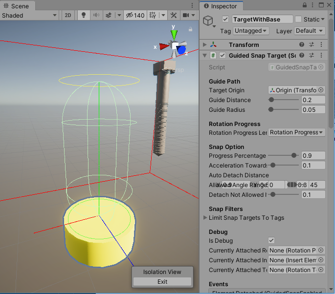
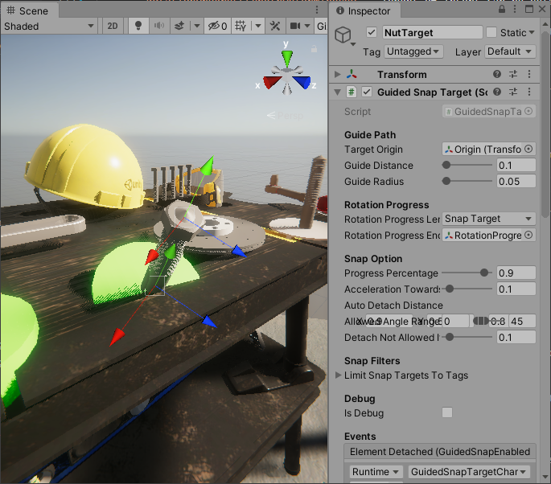
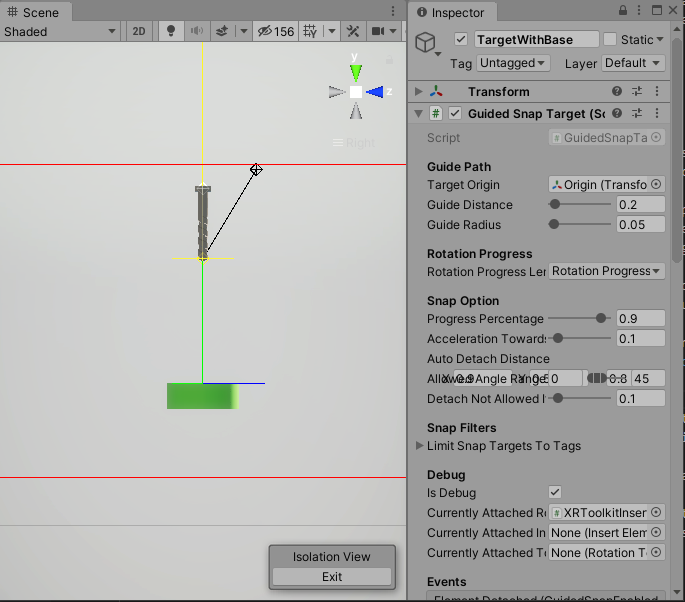
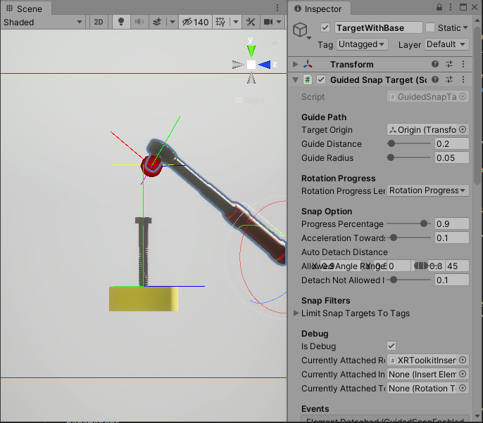
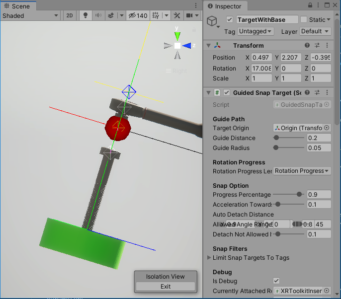
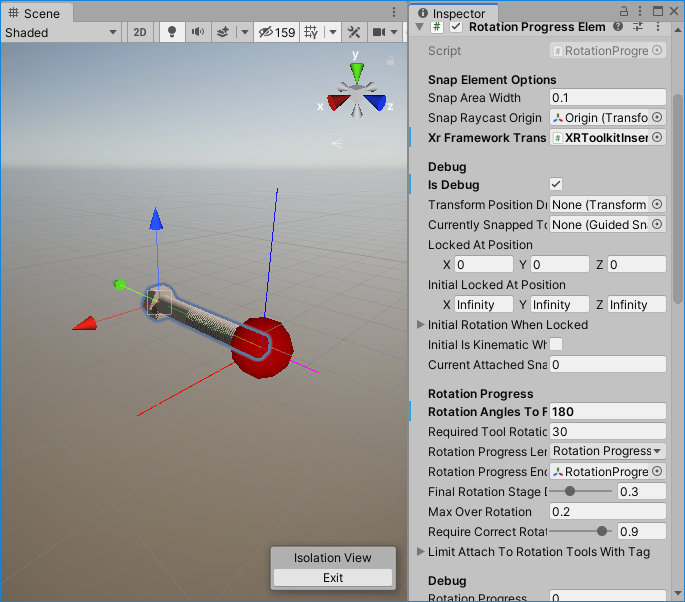
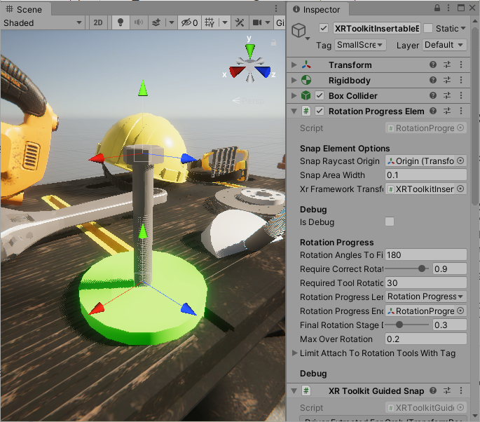
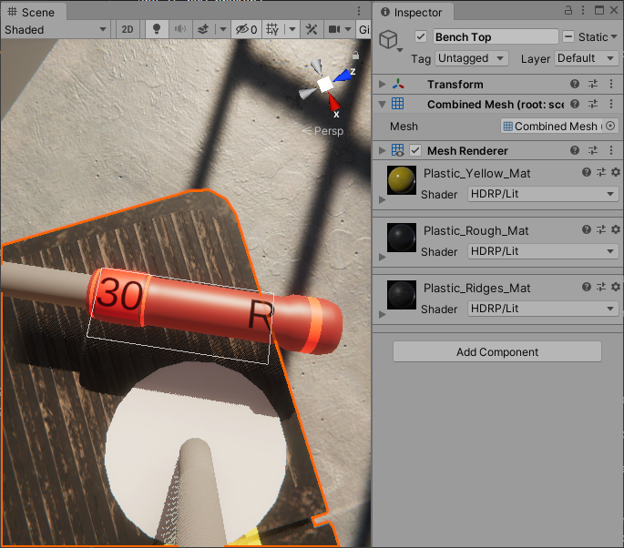
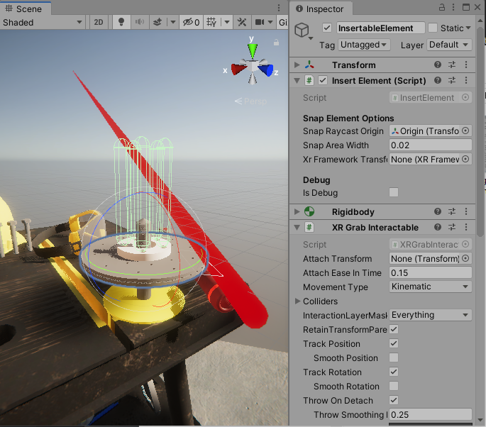

# Immersive VR Mechanic Tools & Interactions

## XRToolkit Setup
> As a prerequisite you need to:
> - start project with HDRP template (if you're not using HDRP please look at section **URP** / **Surface Shaders** 
> - enable VR support
>    - 2019 -  `Virtual Reality Supported` from `Edit -> Project Settings -> Player` menu
>   - 2020 - go to `Edit -> Project Settings -> XR Plug-in Management`
>       - enable `Initialize XR on Statup` and correct provider
>       - **there seems to be a bug with Oculus - you might need to change `StereoRenderingMode` to `SinglePass Instanced`**
> - install `XR Interaction Toolkit` (preview 0.9.4)

### XRToolkit Demo
> **Demo scene was tested in Unity 2019.4 using HDRP - to run it with no issues your setup should be the same.**

If you don't want to setup asset by hand you can simply launch scene `ImmersiveVRMechanicTools\Scenes\XRToolkitDemoScene`
> After opening demo scene you could be asked to update TextMeshPro, if that happens you might need to reopen the scene for text to be correctly rendered

### XR Toolkit Preparation Steps
To get scene locomotion / interactions working

1) In game object hierarchy add `XR -> Room-Scale XR Rig`
2) On `Camera Offset` game object add `Locomotion System`, `Snap Turn Provider` and `Teleportation Provider`
3) On `Ground` game object add `TeleportationArea` component
4) On `Main Camera` adjust `Clipping Planes - Near` to `0.1`

### One Time Setup Steps
1) On both `LeftHand Controller` and `RightHand Controller` add
    - `XRToolkitHapticFeedbackControl`
    - `TransformPositionDriver`
        - and assign `XRToolkitHapticFeedbackControl` to `HapticFeedbackControl` field
    - `XRToolkitFrameworkToolInput`

### Usage Steps
1) Add `TargetWithBase` prefab to scene from `ImmersiveVRMechanicTools/Prefabs` folder
2) Add `XRToolkitInsertableBolt` prefab to scene
3) Add `XRToolkitTorqueWrench` prefab to scene
    - in `RotationTool` component add `XRFrameworkToolInputs` (controllers) `LeftHand Controller` and `RightHand Controller`


### Manual Setup (no prefabs)

#### Rotation Tool (eg Torque Wrench)
1) add `RotationTool` script to object  
2) add `XRToolkitTransformControl`
3) add `XRToolkitGuidedSnapElementDriverExtractor` - required events will be automatically set, if not:
    - on `XRGrabInteractable` link `OnSelectEnter` event with `XRToolkitGuidedSnapElementDriverExtractor.ExctractGuidedSnapElementDriverForGrab` 
    - and `OnSelectExit` with `XRToolkitGuidedSnapElementDriverExtractor.ExctractGuidedSnapElementDriverForUngrab`
    - on `XRToolkitGuidedSnapElementDriverExtractor` link `DriverExtractedForGrab` with `RotationTool.RegisterElementDriver`
    - and `DriverExtractedForungrab` with `RotationTool.UnregisterElementDriver`
4) on `RotationTool` `XRFrameworkToolInput` elements will be auto added if present in the scene

#### RotationProgressElement (eg Bolt)
1) add `RotationProgressElement` scropt to object
2) add `XRToolkitTransformControl`
3) add `XRToolkitGuidedSnapElementDriverExtractor`

#### GuidedSnapTarget
1) add `GuidedSnapTarget` script to object, there should be no depedency setup required

You can now pick up the bolt, insert it into target and use torque wrench on. Other prefabs are as simple to use just drop on the scene, in following sections customisation options will be further described.
       
## VRTK Demo
> As a prerequisite download VRTK (v4) from https://github.com/ExtendRealityLtd/VRTK and launch `Farm` demo scene. (tested with commit **967b335**)

### Run from existing project
1) Download [existing Unity project files](Assets~/VRTK_Demo.zip)
2) Extract files
3) Add folder as a Unity Project and run (best with version 2019.4)
4) Import Immersive VR Mechanic Tools & Interactions from asset store
5) On start screen make sure `Enable VRTK Integration` is enabled and `Shaders` are set to `Surface`
6) Run demo scene from `Samples\Farm\Scenes\ExampleScene`

### Or Set up manually - One Time Setup Steps
1) On both `LeftControllerAlias` and `RightControllerAlias` add
    - `VRTKHapticFeedbackControl`
        - this will add `XRNodeHapticPulser` script where correct `Node` needs to be set
    - `TransformPositionDriver`
        - assign `VRTKHapticFeedbackControl` to `HapticFeedbackControl` field
    - `VRTKFrameworkToolInput`
        - to set up tool-force change link `ValueChanged` event on `InputMappings/UnityXR.OpenVR.<correct-hand>Controller/JoystickAxis/VerticalAxis` with `VRTKFrameworkToolInput.RegisterForceAxisValueChange` (on `<correct-hand>ControllerAlias`)     
        > VRTK seems to have a small issue where VerticalAxis for left and right return opposite values on different controllers (you can use `RegisterForceAxisValueChangeInverse` when that happens, likely on left controller)  
        - to set up tool-direction change link `ValueChanged` event on `InputMappings/UnityXR.OpenVR.<correct-hand>Controller/Trackpad/Press` with `VRTKFrameworkToolInput.RegisterSideChangeButtonChange` (on `<correct-hand>ControllerAlias`)

## VRIF (Virtual Reality Interaction Framework)

### Manually - One Time Setup Steps
1) On `XR Rig` (or other object with `InputBridge`) 
    - add `VRIFFrameworkToolInput`
    - add `VRIFHapticFeedbackControl`
2) On both `Grabbers` in `LeftController` and `RightController` add
    - `TransformPositionDriver`
        - assign `VRIFHapticFeedbackControl` to `HapticFeedbackControl` field
    - `VRIFGuidedSnapElementDriverExtractor`
    - `VRIFFrameworkToolInput`


### Usage Steps
- Add prefabs from `Prefabs\VRIF` folder:
    - `VRIFTorqueWrench`
    - `VRIFInsertableBolt`
- Add prefab from `Prefabs` folder `NutTarget`

This will get you basic setup to test against. Other adjustments will need to be done in VRIF framework, eg.
- how tools/items are gripped by framework


# Editor customisation

> Some components will have `IsDebug` field in editor, once clicked more options / helpful scene drawings will be visible.

## Guided Snap Target
Component is used as a target for snap elements, eg. `Screws` / `Bolts` / `Insertable Items`.

- Guide Path
    > Elements snap onto path where they can only be moved in that direction. Rotation only allowed in perpendicular axis.

    
    - `TargetOrigin` - the point where snappable objects will be considered fully inserted and will 'lock' in place (in debug mode that's where transform Forward/Top/Right direction lines are coming out of)
    - `GuideDistance` - lenght from `TargetOrigin` where `GuidedSnapEnabledElements` will start moving along guide path (modifying this value will automatically adjust capsule collider)
    - `GuideRadius` - radius of capsule collider that is used to determine if `GuidedSnapEnabledElements` should be attached to guide path (modifying this value will automatically adjust capsule collider)
    - `WhileOnGuidePathFixRotationToInitialTransformRotation` - use to lock in some specific rotation while on guide path - useful for objects that need to be put in some specific position

- Rotation Progress
    - `RotationProgressLengthDeterminedBy` - when tightening or loosing by applying rotation on specific axis progress lenght can be determined in 2 modes:
        - `RotationProgressElement` - the attached element dictates how far it can be tightened / loosened. Eg. Bolt can define what length it is in order to be fully tightened. (more info in `RotationProgressElement` section)
        - `SnapTarget` - the target itself dicates how far elements can ge tightened. Eg. nut that goes along threaded bolt towards target base.
            - `RotationProgressEndPoint` - in case of `SnapTarget` mode, end point needs to be specified. Then lenght from `TargetOrigin` to `RotationProgressEndPoint` will be used for tightening
        

- Snap Options
    - `ProgressPercentageToConsiderPathFinished` - not every element needs to be inserted 100% towards target, a lower value is generally better to lock element in place
    - `AccelerationTowardsGuidePathRequiredToAttach` - elements can be attached if objects have specified accelelation towards guide path, this is to prevent elements from attaching if they are not moving in desired direction, eg bolt being pushed up from the bolt-hole instead of being pushed down
    - `AutoDetachDistance` - once item is attached to guide path or locked in place it needs to pulled further to detach, this is to prevent accidential detaching when rotating around or trying to insert elements. It can be adjusted indepedently on each axis. Eg. leaving more space for rotation tightening move and less for upward movement that'd incidate detach intention. **In debug mode area is indicated with red box.**
    
    *TransformPositionDriver (black) close to detach point but not far enough to trigger, moving it bit further will detach element and return transform control back to VR framework*
    - `AllowedAngleRange` - elements can have specific angle range where they'd be allowed to snap to guide path. For example bolt needs to be inserted in perpendicular to bolt-hole to snap, same for wrench tool. 
    
    *Angle not withing alowed range, won't attach*

        
        *Attachement angle within limits, correctly attached and now also axis aligned, movement can only happen along green line*

    > Axis alignment is using forward / up / right directions of respective `Origin` points, the tool will align green / red / blue lines to overlap, this can be used to simply specify direction by adjusting `Origin` point rotation

    - `DetachNotAllowedIfRotationProgressMoreThan` - bolts / screws that are already tightened past this point can't be detatached unless untightened

- Snap Filters
    - `LimitSnapTargetsToTags` - this will prevent snap elements without specified tag to be attached. Eg. Nut should only be attached to nut-target with proper graphics (threaded bold / etc)

- Initial Snap
  - `InitiallyAttachedRotationProgressElement` - bolts / screws can start already inserted with some specific progress (eg half way done) - use this variable to assign (on scene start asset will ensure they are in correct position)
  - `InitiallyAttachedElementRotationProgress` - use in conjunction with `InitiallyAttachedRotationProgressElement` - specifies progress 

- Events
    - `ElementAttached` - element attached to drive path
    - `ElementDetached` - element detached from drive path - usually due being pulled away
    - `TryAttachSucceeded` - similar to element attached but with slightly different parameters
    - `TryAttachFailed` - if element can not be attached this event will be fired and arguments will indicate the reason:
        - `SameElementAlreadyAttached`
        - `UnableToAttachAngleNotWithinRange` - angle range incorrect
        - `UnableToAttachInvalidTag`
        - `UnableToAttachOtherElementAlreadyAttached`
        - `UnableToAttachNotCorrectDriverAcceleration` - likely element is not being pushed towards target, this can indicate it's not user intention to snap to guide but object is merly passing by
        - `UnableToAttachNoRotationProgressElementLocked` - when trying to attach `RotationTool`, eg torque wrench without first placing `RotationProgressElement` ie. bolt / nut
        `UnableToAttachRotationToolAsRotationProgressElementDoesNotAllowTag` - eg. when nut `RotationProgressElement` specifies that it can be tightened with `Wrench` only and user tries to use `TorqueWrench`
        - `UnableToAttachProgressElementLengthDeterminationModeMismatch` - when `SnapTarget` and `RotationProgressElement` specify different `RotationProgressLengthDeterminedBy` - this incidates that element eg. nut is tried to be snapped to target that does not support that

- Debug
    - `CurrentlyAttachedRotationProgressElement` - what progress element is attached to target, eg bolt
    - `CurrentlyAttachedInsertElement` - what insert element is attached to target, eg. break-disc that contains further `SnapTargets` for bolts
    - `CurrentlyAttachedTool` - tool that's attached, eg. wrench


## Guided Snap Enabled Element
Base class for specific types that can be attached to `GuidedSnapTarget` and slide along target-path, as well as snap to the end. Those can be 
- bolts / screws
- nuts
- tools, wrench / torque-wrench
- parts that need to slot into specific position

Ajustments are done on classes that implements it, common properties inlcude:
- Snap Element Options
    - `SnapRaycastOrigin` - origin point that will collide with `GuidedSnapTarget` collision-area to determine if element is in range for attachment. The rotation of that point is aslo used to determine if attachment angle is within allowed limits (eg. forcing bolts to be inserted faily perpendicular to target)
    > in debug mode visible as red sphere
    - `SnapAreaWidth` - width of sphere collision from `Origin` point
    > in debug mode transform XYZ axis rendered as lines coming out of origin
    - `XrFrameworkTransformControl` - this is required to correctly take control over transform from XR framework when element is attached to drive-path, it should be auto populated on creation

### RotationProgressElement (eg. Bolt / Nut)
Elements that can be inserted into `GuidedSnapTarget` and tightened / loosened via tools.



- Snap Element Options (derived from `GuidedSnapEnabledElement`)
- Rotation Progress
    - `RotationAnglesToFinish` - determines how many angles need to be made with tool to get element 100% tightened
    - `RequireCorrectRotationForceFromRotationProgress` - from that percentage specific minumum force on rotation tool will be required to keep tightening 
    - `RequiredToolRotationForce` - minumum tool rotation force required in final rotation step (as defined in above)
    -  `RotationProgressLengthDeterminedBy` - lenght of insert can be determined in 2 modes
        - `RotationProgressElement` - used for elements that go **into** target (eg. bolts), in that case bolt defines how far it can be inserted. 
           
        > Measured as distance from `Origin` to `RotationProgressEndPoint` on `RotationProgressElement` for easy customisation 
    
        - `SnapTarget` - used for elements that go **onto** target (eg. nut / target-path for custom element) - in that mode target itself defines how far element can go. (more info in `GuidedSnapTarget` section)
        > Measured as distance from `Origin` to `RotationProgressEndPoint` on `GuidedSnapTarget` for easy customisation 
    - `RotationProgressEndPoint` - as described above, should be auto populated on creation, if not assign manually
    - `FinalRotationStageDampProgressMultiplier` - in final rotation stage accumulating progress will be modified using this value
    - `MaxOverRotation` - element can be rotated beyond 100% using that value, when that happens it'll fire event (eg. indicating that bolt has been over-tightened and is now broken). 

- Filter
    - `LimitAttachToRotationToolsWithTag` - if populated only tools with defined tags will be able to tighten/loose this element, eg. nuts can only be worked with Wrench but not Torque-Wrench

### Rotation Tool (eg Torque-Wrench)
Objects used to tighten/loose with other `RotationProgressElements`

- Snap Element Options (derived from `GuidedSnapEnabledElement`)
- Tool Options
    - `RotationProgressAccumulationDirection` - used to specify direction in which tool works
        - left is used to loosen items, moving to right will still rotate but neither loosen nor tighten element
        - right used to tighten items, moving to left will still rotate but neither loosen nor tighten element
        > left / right can be used for tools like `TorqueWrench` that operate in single direction
        - both - right and left and will tighten and loosen respectively
        > used for tools like `Wrench` 
    - `RotationProgressAccumulationDriverMethod` - tightening / loosing can be based on 
        - `AngleDueToPositionChange` - this is for tools that you move, eg torque wrench
        - `AngleDueToRotationChange` - this is for tools that you rotate, eg screwdriver
    - `RotationToolForce` - force that tool can apply towards `RotationProgressElement`, the latter can specify what's minumum force needed to move in final stage
    - `IsRotationForceAdjustable` - some tools can support dynamic tool force adjustments
    - `MinRotationToolForce` / `MaxRotationToolForce` - allowed tool force adjustment range
- Rotation Result Multipliers
    > at various stages of tightening tool movement can be dampened to simulate resistance, eg when over rotating bolt user should feel that's it's not going as easy as in the begining. That's achieved with specifying `MaxAnglePerSecond` for various tages
    - `AddedMaxMoveAnglePerSecond` - standard operation
    - `NotEnoughForceMaxMoveAnglePerSecond` - without enough force limit is set to 0 meaning tool will not move at all
    - `OverRotatingMaxMoveAnglePerSecond` 
    - `OverRotatingBreakingPointMaxMoveAnglePerSecond` - when the element is broken
    - `FinalRotationStageMaxMoveAnglePerSecond`
- Tool Direction Auto Recognition
    - `AutomaticallyRecognizeToolDirection` - when enabled rotation tool will try to automatically change `RotationProgressAccumulationDirection` based on user intent, eg when starting on bolt that's nearly fully tightened it'll start undoing it. When using on bolt that's just inserted it'll start tightening
- Tool Display
    - `ForceText` - game object that's used to display current tool force
    - `DirectionText` - game object that's used to display current tool direction (L/R)
    
- Events
    - `RotationChanged` - fired whenever rotation changed, passed on relevant information like
        - `CurrentProgress`
        - `MovedAngle`
        - `AddRotationProgressStatus` - which can indicate which phase rotation is in, eg `OverRotating`
        - `RotationProgressElement` - rotated element
        - `TransformPositionDriver` - element that drives rotation, eg controller

### Insert Element
Objects that simply need to be inserted into specific places, like `DiscBrake` that should go onto the bolt


- Snap Element Options (derived from `GuidedSnapEnabledElement`)
- Insert Element Options
    - `CanAttachRotationProgressElements` - initial value to indicate if bolts can be inserted, this will be auto enabled/disabled when element is attached to `SnapTarget`
    - `IsElementDetachmentDisallowingChildElementsAttachmentDetachment` - when set additional elements can not be attached unless the parent element is attached to something itself. Eg when putting screws on some part that needs to be mounted on engine block. With setting on screws wont come in unless part is already positioned. 

## Integrating Custom Framework - Code Changes
If you're not using any framework with integrations created you'll have to override few scripts.

> Existing implementations will give you an idea how that can be implemented in your framework.

### XRFrameworkToolInput
This script is used to let components know when player requests to increase / decrease tool force or requests to change direction.

Methods to override:
```
protected override bool IsIncreasingToolForce()
protected override bool IsDecreasingToolForce()
protected override bool IsChangingToolDirection()
```

Generally it should be as simple as finding if keys are pressed on controllers.

### XRFrameworkTransformControl
When element is on drive-path or being rotated - asset will take control over it's transform (this is to prevent your framework constantly trying to readjust position).

Methods to override:
```
public override void TakeControlFromXrFramework()
public override void PassControlBackToXrFramework()
```

Depending on framework you can usually temporality disable component that controls object transform when it's in `grabbed` state.

### HapticFeedbackControl
Simply override to provide method implementation that'll be used for haptic feedback.

Methods to override:
```
public override void SendHapticFeedback(float amplitude, float duration)
```

### XRFrameworkGuidedSnapElementDriverExtractor
While there's no base to implement - most frameworks will have a concept of `grabbing` which will give you access to controller / avatar element that's used. That element will have `TransformPositionDriver` that needs to be registered with grabbed `GuidedSnapEnabledElement` (to properly support moving in relation to controller).

## URP/Surface Shader Adjustments
Tool should automatically recognize if you're using HDRP / URP / Surface shaders and adjust as needed. If not you can choose `ShaderMode` via Preferences or Start Screen.

> **When using demo scene with Surface shaders you need to change `Light` intensity to some smaller value, eg. 1 to see colors properly.**

If for some reason they do not get automatically adjusted you'll have to go to Materials and manually change Shader to supported one, eg. 'Standard'

That will need to be done for all materials in `/Materials` and `Models/Materials` folders.